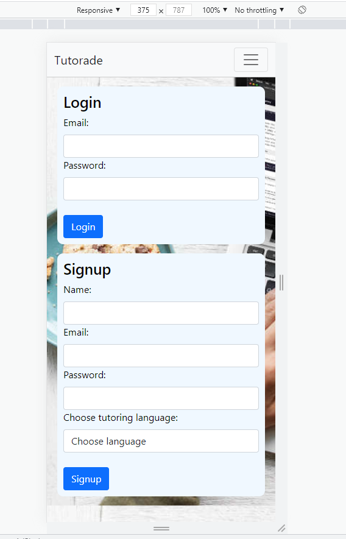
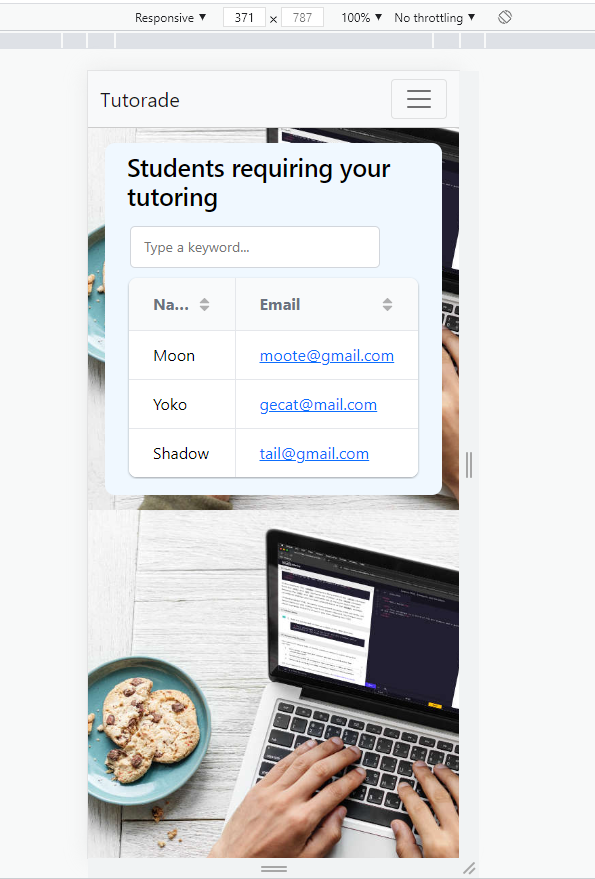

# Tutorade
Finding a Tutor is so Refreshing!!

---
[Tutorade! - HEROKU deployed version 🚀](https://new-tutor.herokuapp.com/login) 

[Github repo ](https://github.com/Conso97/Tutorade) 

---


## About 
A service that allows the user to sign in as a tutor. Providing the option to choose a programming language they are knowledgeable on and search for students, sending email to them.


## User Story

```
AS A tutor
I WANT to post a programming language I am knowledgeable in and find a student who wants to learn the language
SO THAT I can offer sustainable tutoring support
```
## Installation 
- Download it through Github
- Run npm i or (npm install), to make sure to download the jason package and inquirer.

## Usage 
1. use ```git clone ``` to clone repo sources
2. create a branch with the ```git checkout -b <your_branch_name>```
3. push your branch with ```git push -u origin <your_branch_name>``` 
4. create a pull request for our review

## Screenshots of the page

| |  |
| --- | --- |
| Mobile view 1  | Mobile view 2 |

| |  |
| --- | --- |
| Laptop view 1  | Laptop view 2 |
## What's included

- MySQL
- Sequelize
- Handlebars
- Bootstrap Framework
- Build in HTML5 validation
- Node.js
- Bcrypt
- Grid.js

  
## How can I contribute or help?
- Star our GitHub repo :star:
- Create pull requests, submit bugs, suggest new features or documentation updates :wrench:

## How to download the sources and contribute on the code
1. use ```git clone ``` to clone repo sources
2. create a branch with the ```git checkout -b <your_branch_name>```
3. push your branch with ```git push -u origin <your_branch_name>``` 
4. create a pull request for our review

## From developers
Made by [Consolata](https://github.com/Conso97), [Michelle](https://github.com/michellecoder), [Manuhuia](https://github.com/ManuhuiaBarcham), [Mohamed](https://github.com/MohamedMesahel) and [Mariia](https://github.com/MaryVPie).
We're always happy to receive your feedback!

## More from us
To be updated with new projects.

